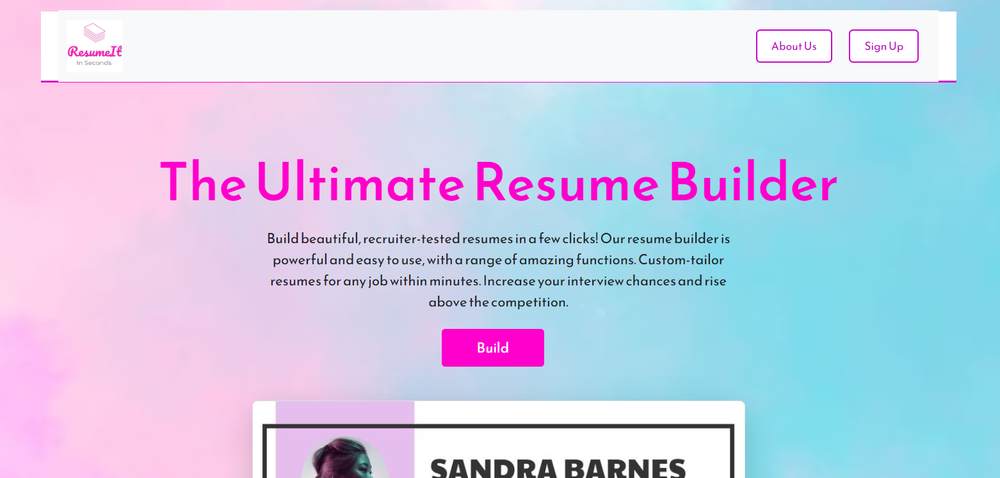
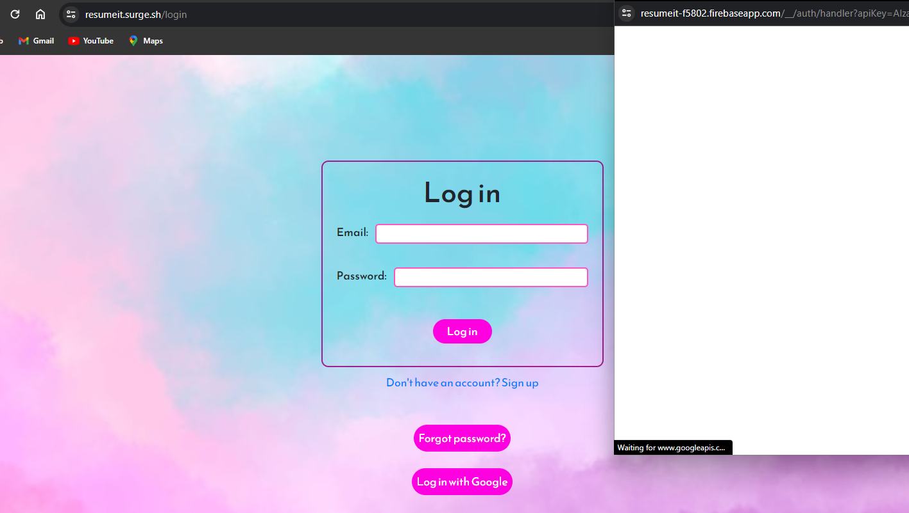
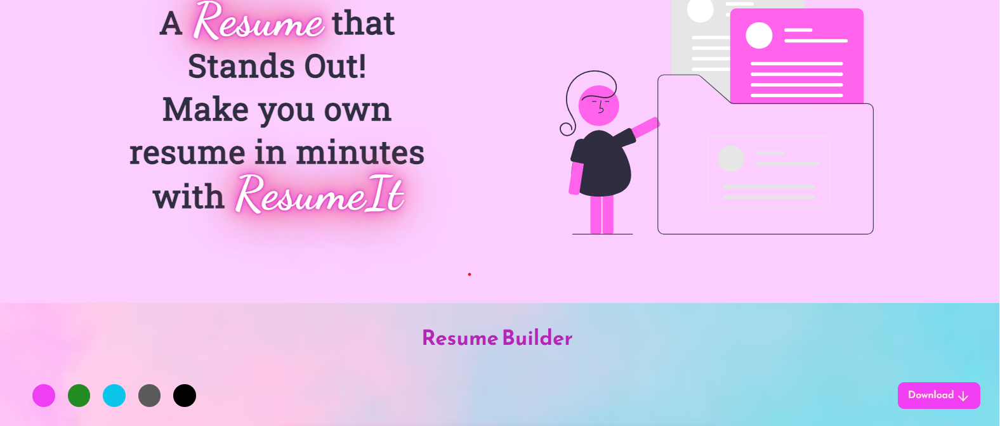
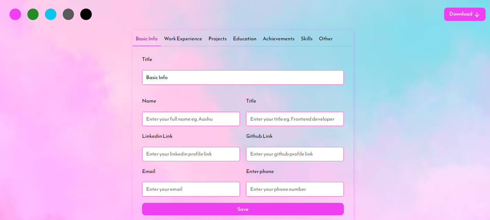
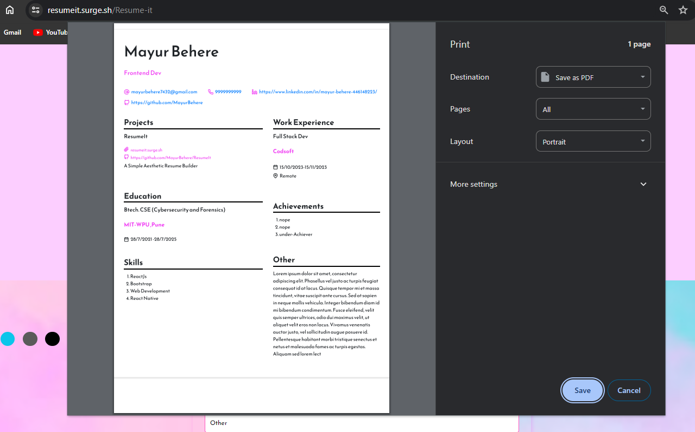

<br/>
<p align="center">
  <h3 align="center">ResumeIt</h3>

  <p align="center">
    A Simple Aesthetic Generator you need ! UwU
    <br/>
    <br/>
    <a href="https://resumeit.surge.sh">Go to Website</a>
    .
  </p>
</p>

    

## About The Project







Welcome to ResumeIt - the ultimate Resume Builder designed to simplify the process of creating professional resumes effortlessly.

Why ResumeIt Stands Out:
There are countless resume-building tools out there, but ResumeIt sets itself apart for a few reasons:

Focus on Creativity: Your time should be devoted to crafting a standout resume that solves your professional needs.

Eliminating Repetitive Tasks: No more starting from scratch each time you need a new resume.

Adopting DRY Principles: Just as in coding, let's keep our lives efficient by avoiding redundancy.

This README aims to be the definitive guide for using ResumeIt effectively. While it won't cover every unique use case, it's designed to support most scenarios, making resume creation a breeze.

Future Updates:
In the near future, expect enhancements and additional sections in this README. These updates aim to accommodate diverse user requirements and further simplify the resume-building process.

Acknowledgements:
This project wouldn't be possible without the support of various resources. The acknowledgements section lists these valuable resources that have shaped and enriched the ResumeIt project.

## Built With

ResumeIt is constructed using a blend of technologies and tools that include:

React: A powerful JavaScript library for building user interfaces efficiently.
Firebase Authentication: Securely handles user authentication with Firebase's robust services.
Firebase Realtime Database: Manages real-time data updates and synchronization between users' inputs and the application.
HTML & CSS: Fundamental web technologies for structuring and styling the user interface.
JavaScript (ES6+): The core programming language used for implementing functionality and interactivity.
React Drag and Drop: Utilized for enabling users to easily drag and reposition different resume sections.
Bootstrap: A popular front-end framework for responsive and mobile-first web development. Used for rapid prototyping and enhancing the UI responsiveness.
Color Customization Feature: Implemented to allow users to customize section titles' important parts with varying colors.
Industry Standard Resume Formatting: Ensuring the generated resumes meet industry standards for elegance and professionalism.
These technologies have been seamlessly integrated to provide a user-friendly, feature-rich experience while creating professional resumes with ResumeIt.

## Getting Started

To get a local copy up and running follow these simple example steps.

### Prerequisites

```sh
npm install firebase
```

* npm

```sh
npm install npm@latest -g
```

### Installation


1. Clone the repo

```sh
git clone https://github.com/MayurBehere/ResumeIt.git
```

2. Install NPM packages

```sh
npm install
```

3. Create an Account on firebase console and config as per need

## Usage

ResumeIt is a user-friendly Resume Builder designed to simplify the process of crafting professional resumes. Follow these steps to create your personalized resume:

1. Access the Application
Open your web browser and navigate to the ResumeIt application.
Sign in using Google Authentication to access the Resume Builder.
2. Fill in the Resume Form
Upon logging in, you'll be presented with a form divided into various sections like "Basic Info," "Work Experience," "Education," "Projects," "Achievements," "Skills," and others for additional information.
Fill in the required details in each section by typing or selecting relevant information.
3. Customize Section Titles (Optional)
Use the color feature to highlight important parts of section titles. Click on the color option available for each section title to personalize the appearance.
4. Rearrange Sections
Take advantage of the drag-and-drop functionality to rearrange the order of sections according to your preference. Simply click and hold on the section title, then drag it to the desired position.
5. Generate and Download Resume
Once all necessary information is filled in and arranged, click on the "Generate Resume" or "Download" button (whichever is provided) to create your professional resume.
Your resume will be generated in an industry-standard and elegant format.
6. Review and Save
Review your generated resume for accuracy and completeness.
Download the resume in PDF format or any other supported format and save it for future use or distribution.
7. Logout
When finished, logout securely to ensure the protection of your authentication credentials.

## Roadmap

See the [open issues](https://github.com/MayurBehere/ResumeIt/issues) for a list of proposed features (and known issues).

## Contributing

Contributions are what make the open source community such an amazing place to be learn, inspire, and create. Any contributions you make are **greatly appreciated**.
* If you have suggestions for adding or removing projects, feel free to [open an issue](https://github.com/MayurBehere/ResumeIt/issues/new) to discuss it, or directly create a pull request after you edit the *README.md* file with necessary changes.
* Please make sure you check your spelling and grammar.
* Create individual PR for each suggestion.
* Please also read through the [Code Of Conduct](https://github.com/MayurBehere/ResumeIt/blob/main/CODE_OF_CONDUCT.md) before posting your first idea as well.

### Creating A Pull Request

1. Fork the Project
2. Create your Feature Branch (`git checkout -b feature/AmazingFeature`)
3. Commit your Changes (`git commit -m 'Add some AmazingFeature'`)
4. Push to the Branch (`git push origin feature/AmazingFeature`)
5. Open a Pull Request

## License

Distributed under the MIT License. See [LICENSE](https://github.com/MayurBehere/ResumeIt/blob/main/LICENSE.md) for more information.

## Authors

* **Mayur Behere** - *Computer Science Student & Web Developer* - [Mayur Behere](https://github.com/MayurBehere/) - *Frontend , Functionality & Documentation*
* **Prathamesh Patil** - *Computer Science Student & Web Developer* - [Prathamesh Patil](https://github.com/prathamesh093) - *Authentication Backend*

## Acknowledgements

* [Krishnaraj Thadesar](https://github.com/KrishnarajT)
* [Saubhaghya Singh](https://github.com/SaubhagyaSingh)
* [Handy Dev](www.youtube.com/handydev1)
